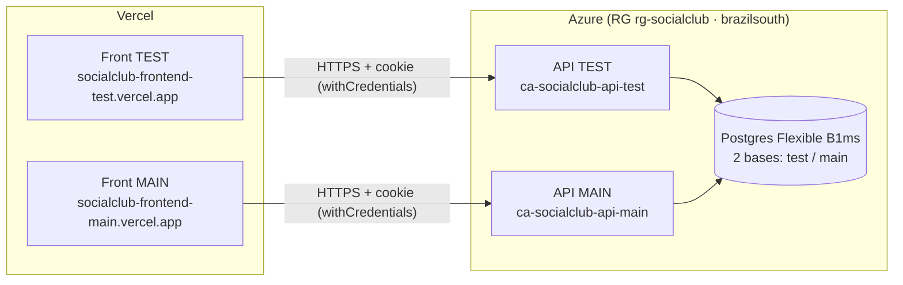

# SocialClub — Infraestructura y despliegue (frontend)

> Documento de referencia con **todas las decisiones de infraestructura y despliegue** del proyecto SocialClub. Cubre el panorama completo (front + API + DB), con foco en el frontend. La API/DB están documentadas en detalle en `DESPLIEGUE.md` del repo `socialclub-backend`. Última actualización: 2026-08-07.

---

## 1. Panorama general

Dos entornos independientes y paralelos: **test** y **main** (producción). Cada uno = frontend (Vercel) + API (Azure Container Apps) + base de datos (Azure PostgreSQL).



**Mapa rama → entorno** (Git Flow: `feature/* → dev → test → main`):

| Rama | Proyecto Vercel | API que consume | Deploy |
|---|---|---|---|
| `dev` | — (solo CI/preview) | — | No es producción |
| `test` | socialclub-frontend-test | API TEST | **Automático** en push (producción del proyecto test) |
| `main` | socialclub-frontend-main | API MAIN | **Automático** en push (producción del proyecto main) |

**URLs productivas**

| | TEST | MAIN |
|---|---|---|
| Front | https://socialclub-frontend-test.vercel.app | https://socialclub-frontend-main.vercel.app |
| API | https://ca-socialclub-api-test.agreeablehill-d095161e.brazilsouth.azurecontainerapps.io/api/v1 | https://ca-socialclub-api-main.agreeablehill-d095161e.brazilsouth.azurecontainerapps.io/api/v1 |

---

## 2. Decisiones clave (y por qué)

| Decisión | Elección | Motivo |
|---|---|---|
| Hosting Front | **Vercel** (2 proyectos, uno por entorno) | Free tier suficiente para SPA; deploy automático por integración Git; build por entorno. |
| Estrategia por entorno | **2 proyectos** ligados al mismo repo | Cada proyecto fija su **production branch** (`test` / `main`) y su `VITE_API_URL`. Simple y con URLs estables. |
| Config de API en el front | **`VITE_API_URL` build-time** | Vite reemplaza `import.meta.env.VITE_API_URL` al compilar → cada entorno necesita su propio build. |
| Routing SPA | **`vercel.json` con rewrite a `index.html`** | React Router (client-side): sin el rewrite, refrescar en rutas profundas daría 404. |
| Hosting API | Azure Container Apps (escala a cero) | Cuota gratuita; escala-a-cero para no gastar crédito. |
| Base de datos | 1 Postgres Flexible B1ms + 2 bases | Más barato que 2 servidores; aislado por base. |
| Cookie de sesión | **`SameSite=None; Secure`** en prod | Front (Vercel) y API (Azure) en dominios distintos → la cookie de auth debe ser cross-site. |

---

## 3. Frontend en Vercel

- **Cuenta:** `lucasjg017` (Vercel).
- **Proyectos** (ambos vinculados a `github.com/lucasgazzola/socialclub-frontend`, framework **Vite**):

| Proyecto | Production branch | `VITE_API_URL` | URL |
|---|---|---|---|
| `socialclub-frontend-test` | `test` | API TEST `/api/v1` | socialclub-frontend-test.vercel.app |
| `socialclub-frontend-main` | `main` | API MAIN `/api/v1` | socialclub-frontend-main.vercel.app |

- **Deploy:** integración nativa Git de Vercel. Push a la production branch de cada proyecto → build (`tsc -b && vite build`) + deploy de producción. Otras ramas generan **preview deployments**.
- **`vercel.json`** (en la raíz del repo):

  ```json
  { "rewrites": [ { "source": "/(.*)", "destination": "/index.html" } ] }
  ```

- **Variable de entorno:** `VITE_API_URL` está seteada por proyecto (targets `production` y `preview`). Es **build-time**: cambiarla requiere un nuevo build.
- El cliente HTTP usa `withCredentials: true` para enviar/recibir la cookie httpOnly del JWT.

> **Nota:** como cada proyecto está ligado al mismo repo, un push a `test` o `main` dispara también un *preview* en el otro proyecto. Es ruido inofensivo; el deploy de **producción** solo ocurre en la production branch de cada proyecto.

---

## 4. Backend / Azure (resumen)

Detalle completo en `socialclub-backend/DESPLIEGUE.md`. Resumen:

- **API:** Azure Container Apps (`ca-socialclub-api-test` / `ca-socialclub-api-main`) en el environment `cae-socialclub`, RG `rg-socialclub`, región `brazilsouth`. Ingress externo, puerto 3000, escala 0→1.
- **Imagen:** `ghcr.io/lucasgazzola/socialclub-backend` (pública). El entrypoint aplica migraciones + seed en cada arranque.
- **DB:** Postgres Flexible B1ms `psql-socialclub-8ea842`, bases `socialclub_test` / `socialclub_main`, `sslmode=require`.
- **CI/CD backend:** GitHub Actions con **OIDC** (federated credentials, sin secretos de larga vida). `cd-test` automático; `cd-main` con **aprobación manual** (GitHub Environment `production` con reviewer).
- **Auth:** JWT en cookie httpOnly `access_token`, `SameSite=None; Secure` en prod, RBAC por roles.

---

## 5. CORS (clave para que el login funcione)

La API valida el origen exacto del front vía la variable `CORS_ORIGIN` (por entorno), con `credentials: true`. Está configurada así:

| Entorno | `CORS_ORIGIN` en la API |
|---|---|
| test | https://socialclub-frontend-test.vercel.app |
| main | https://socialclub-frontend-main.vercel.app |

Si cambia el dominio del front (o se agrega uno propio), hay que actualizar `CORS_ORIGIN` en la Container App **y** en el GitHub Environment secret correspondiente.

---

## 6. Runbook (frontend)

```bash
# Desarrollo local
npm install && npm run dev            # http://localhost:5173 (usa VITE_API_URL o el default local)
npm run typecheck && npm run lint && npm run build

# Desplegar a TEST / MAIN: push a la rama correspondiente (deploy automático en Vercel)
git push origin dev:test
git push origin dev:main

# Cambiar la API que consume un entorno: actualizar VITE_API_URL en el proyecto
# Vercel (Settings → Environment Variables) y volver a desplegar (rebuild).
```

- **Rutas públicas:** `/login`, `/register`. El resto detrás de `ProtectedRoute` (sesión + rol).
- **Sin framework de tests** (decisión del equipo): el CI del front es lint + typecheck + build.

---

## 7. Pendientes / notas conocidas

- **Documentación de variables/credenciales:** `.env.example` documenta `VITE_API_URL`. El detalle de todas las credenciales del proyecto está en `CREDENCIALES.md` (**gitignoreado**, no se commitea).
- **Swagger** de la API está disponible en test (`/api/docs`) pero **no en producción (main)**.
- El deploy del front en Vercel es por **integración Git**, no por GitHub Actions. No requiere secretos en el repo.
- Los **preview deployments** cruzados (push a una rama dispara preview en el otro proyecto) son esperables; se pueden filtrar con "Ignored Build Step" si molestan.
- Para un dominio propio (mismo dominio registrable para front y API) la cookie podría volver a `SameSite=Lax`; hoy se usa `None; Secure` porque los dominios difieren.
